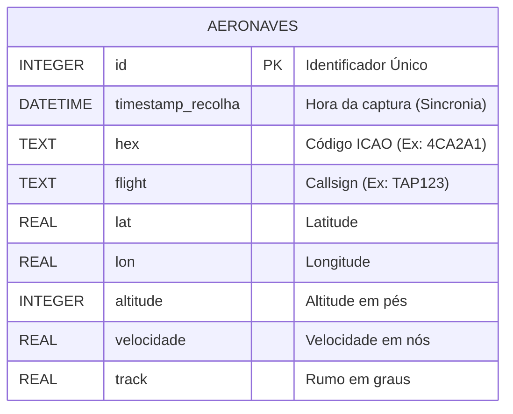

# STAER - Sistema de Visualização de Radar Secundário

Este projeto foi desenvolvido no âmbito da unidade curricular de STAER. O objetivo é a criação de um sistema capaz de recolher, tratar, armazenar e visualizar informação de tráfego aéreo proveniente de radares secundários (SSR) e receptores ADS-B (Modo S).

## Funcionalidades

* **Recolha de Dados:** Script automático que consome dados JSON de fontes `dump1090`.
* **Persistência:** Armazenamento histórico em base de dados SQLite.
* **Visualização Geográfica:** Mapa interativo (OpenStreetMap) focado na zona do Porto.
* **Filtragem Dinâmica:** Filtros para zona geográfica e estado da aeronave (Solo/Voo).
* **Tempo Real:** Atualização automática da interface a cada 10 segundos.

---

## Instalação e Execução

Este projeto foi desenhado para correr em ambiente Linux (Debian/Ubuntu), idealmente num contentor **Proxmox**.

### Pré-requisitos

    sudo apt update
    sudo apt install python3-pip python3-venv git -y

### 1. Configuração do Ambiente

    # Clonar o repositório
    git clone https://github.com/Figueiras3/STAER.git
    cd SWAR

    # Criar e ativar ambiente virtual
    python3 -m venv venv
    source venv/bin/activate

    # Instalar dependências
    pip install requests flask folium

### 2. Executar o Sistema

São necessários dois terminais abertos simultaneamente (via VS Code ou SSH):

**Terminal 1 (Coletor de Dados):**

    source venv/bin/activate
    python coletor.py

**Terminal 2 (Servidor Web):**

    source venv/bin/activate
    python app.py

### 3. Aceder à Aplicação

Abrir o browser no computador e aceder ao IP do servidor na porta 5000:
`http://<IP-DO-SERVIDOR>:5000`

---

## Arquitetura do Sistema

O sistema segue uma arquitetura modular dividida em Recolha, Armazenamento e Visualização.

### Diagrama de Blocos

[Internet] --(JSON)--> [Coletor Python] --(SQL)--> [Base de Dados] <--(SQL)--> [Servidor Web Flask] --(HTML)--> [Browser]

### Componentes de Software

1.  **Módulo de Recolha (`coletor.py`)**:
    * Serviço contínuo (*daemon*) que realiza *polling* a cada 10 segundos.
    * Normaliza dados de altitude (converte "ground" para 0).
    * Sincroniza o *timestamp* de todos os aviões do mesmo ciclo.

2.  **Base de Dados (`radar_data.sqlite`)**:
    * Armazena histórico completo de posições, altitudes e velocidades.

3.  **Interface Web (`app.py`)**:
    * Servidor Flask que gera mapas `Folium` dinamicamente.
    * Implementa lógica de filtragem SQL (Lat/Lon e Altitude).
    * Interface com formulário para interação do utilizador.

---

## Análise de Propagação de Sinal (Pormenores Construtivos)

No âmbito do estudo de radares secundários (1090 MHz), a propagação do sinal comporta-se predominantemente em "linha de vista" (*Line of Sight*). A infraestrutura de receção deve ter em conta os seguintes fatores:

### Atenuação e Bloqueio
* **Obstáculos Físicos:** Edifícios de betão armado ou estruturas metálicas funcionam como Gaiolas de Faraday parciais, atenuando ou bloqueando o sinal ADS-B.
* **Relevo:** Montanhas ou colinas criam zonas de sombra ("shadow zones") intransponíveis para frequências de micro-ondas.

### Zona de Fresnel
A obstrução da Zona de Fresnel (o volume elipsoidal entre emissor e recetor) por telhados, árvores ou muros degrada significativamente a qualidade do sinal, reduzindo o alcance efetivo do radar, mesmo que exista contacto visual direto.

**Conclusão:** Para este projeto, a antena deve ser posicionada no ponto mais alto possível, livre de obstruções metálicas num raio imediato de 2 a 3 metros.

---

## Tecnologias Usadas

* **Linguagem:** Python 3
* **Web Framework:** Flask
* **Mapas:** Folium / Leaflet.js / OpenStreetMap
* **Base de Dados:** SQLite
* **Infraestrutura:** Proxmox VE (LXC Debian 12)

## Diagrama de Funcionamento

```text
       INTERNET                  SERVIDOR (DEBIAN)                  CLIENTE
   +---------------+        +-------------------------+        +---------------+
   |               |  JSON  |      coletor.py         |        |               |
   |   dump1090    +------->|    (Recolhe Dados)      |        |    Browser    |
   | (Fonte Dados) |        +------------+------------+        | (Visualiza)   |
   |               |                     | Grava               |               |
   +---------------+                     v                     |               |
                                +--------+--------+            |               |
                                |                 |   HTML     |               |
                                |    DATABASE     +----------->|               |
                                |    (SQLite)     |            |               |
                                |                 |            |               |
                                +--------+--------+            +-------+-------+
                                         ^                             |
                                         | Lê                          |
                                +--------+--------+                    |
                                |                 |      Filtros       |
                                |      app.py     |<-------------------+
                                |  (Servidor Web) |
                                |                 |
                                +-----------------+


```
## 📊 Modelagem do Sistema

Para complementar a arquitetura, apresentam-se os modelos de dados e de interação do sistema.

### Modelo de Dados (Entidade-Relacionamento)
Este diagrama representa a estrutura da tabela `aeronaves` na base de dados SQLite, essencial para a persistência histórica dos dados.


usecaseDiagram
    actor "Utilizador Final" as User
    actor "Coletor (Automático)" as Bot

    package "Sistema STAER" {
        usecase "Visualizar Mapa em Tempo Real" as UC1
        usecase "Filtrar por Zona (Porto)" as UC2
        usecase "Filtrar por Altitude (Solo/Voo)" as UC3
        
        usecase "Recolher Dados Externos" as UC5
        usecase "Gravar em Base de Dados" as UC6
    }

    User --> UC1
    User --> UC2
    User --> UC3

    Bot --> UC5
    UC5 ..> UC6 : include

```


